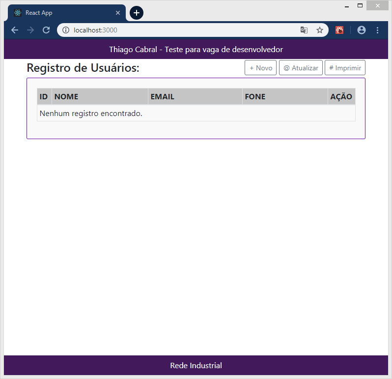

# Teste Rede Industrial - Vaga Desenvolvedor Web

A descrição das tarefas a serem realizadas estão descritas no arquivo ***task.pdf*** localizado nesse projeto.


# Estrutura do projeto

| Pasta      | Descrição                                                    |
| ---------- | ------------------------------------------------------------ |
| 1_api      | Backend: API Restfull desenvolvido em PHP, Slim Framework, PDO (camada de abstração de *acesso* a dados) e banco de dados SQLite 3. |
| 2_frontend | Frontend: Desenvolvido em ReacJS.                            |


# **Banco** de dados

SQLite 3 e está localizado em *./1_api/public/database.sqlite3*.


# Executando o projeto

### Preparação do ambiente

É preciso um servidor Apache para rodar o projeto ***1_api***. (servidor backend);

É necessário instalar ***NodeJS*** e o gerenciador de pacotes Javascript ***Yarn*** para rodar o ***1_frontend*** (frontend).

Link de instalação do NodeJS https://nodejs.org/en/download/package-manager/

Link de instalação do Yarn https://yarnpkg.com/lang/pt-br/docs/install

Por padrão a url do servidor ***1_api*** (backend) é *http://localhost/rede-industrial/1_api/public/api*. Caso mude, alterar no arquivo ***2_frontend/src/services/api.js*** o valor de ***baseURL***.

```
import axios from 'axios'

const api = axios.create({
   baseURL: 'http://localhost/rede-industrial/1_api/public/api',
   timeout: 15000,
});

export default api;
```


### Execução


Criar dentro do diretório ***public_html*** do Apache a pasta **rede-industrial** e copiar ***1_api*** para dentro;

***2_frontend*** execute o comando `yarn install` para baixar as dependência.

Execute o comando `yarn start` na raiz do projeto para iniciar.

Vídeo do ***2_frontend*** funcionando (***apresentacao-frontend.gif***).




Obrigado.

Att, Thiago Cabral